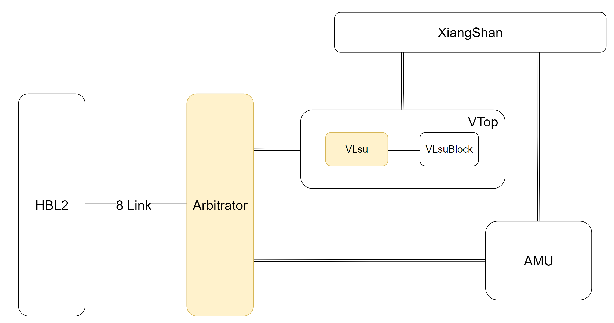

# VPU-HBL2

Vector Processing Unit (VPU) + HBL2 (High Bandwidth L2)

Initialization:

```BASH
git clone git@github.com:LeleCheung/VPU-HBL2.git  
cd VPU-HBL2
git submodule update --init --recursive
```

Chisel Test (test_run_dir/):
```BASH
make test-top
```

Generate Verilog (build/):
```BASH
make gen-top
```

Clean:
```BASH
make clean
```




